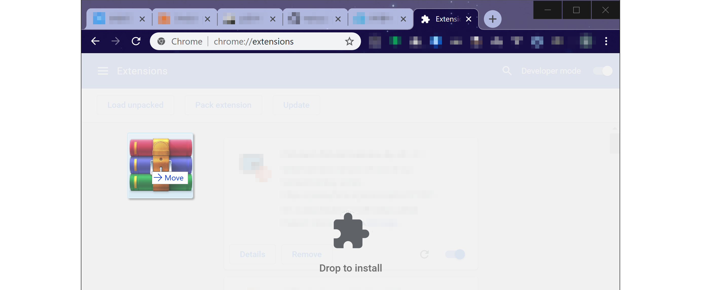

# chromeExtPIP

 

---

[简体中文](./README.md), [繁體中文](./README.zh-tw.md), [English](./README.en.md)

[TOC]

---

The extension allows video to hover on the desktop as a small window.

This extension can be automatically loaded after the video changes, and can adjust the play progress easily with the global shortcut key.

## Technic Support

The extension is based on picture-in-picture technology([Picture in Picture](https://w3c.github.io/picture-in-picture/)).  

Known browsers supporting for this technology :

- chrome 71 and above

other browsers are unknown.

## Installation

### Application Store (recommended)

- Click  to enter store.
- Click `Add to Chrome` to install.
- If need global shortcuts, please complete the setup steps below.

### Installation Package (for developers)

- Click  to get the latest release, and download the zip package to local.

- Open Chrome Extension Manager. Url address is : [chrome://extensions](chrome://extensions). Make sure the developer mod opening.

- Drag the downloaded zip file to the browser page. Done! If need global shortcuts, please complete the setup steps.

## Settings

### Shortcut Settings

**Chrome extension is installed with a default limit of up to 4 shortcuts. You could add more shortcuts manually for fully experience.**

- Page for shortcut settings : url address is [chrome://extensions/shortcuts](chrome://extensions/shortcuts) 

- Assign shortcuts based on personal preference.

- If you want to use the shortcut keys to control the small window globally, ** needs to select global **

Recommended Settings:
* forward：Ctrl + →, Global
* backward：Ctrl + ←, Global
* play and pause：Ctrl + Space, Global
* volume up：Ctrl + ↑, Global
* volume down：Ctrl + ↓, Global

### Options
Right-click the extension icon in the toolbar and select `option` to open the Option Page.

**Content in option page：**

* forward / backward：the time interval for forward and backward. The default is 5 seconds.
* volume up / down：the volume interval for increase and decrease, the default is 5%.
* keep in pip when playing list：When selected, the continuous video will always remain in the small box. Checked by default.
* go to shortcut settings：Open the shortcut Settings page.
* ok：**Click ok to set it**.

## Use
* Click the extension icon, and the video in the page will enter the small window (PIP) mode. Click again to exit.
* After setting the global shortcut key, press Ctrl + ←  backward, Ctrl + → forward, Ctrl + ↑ volume up, Ctrl + ↓ volume down.

---

## support us
### wechat (scan)

### paypal (scan or click)

