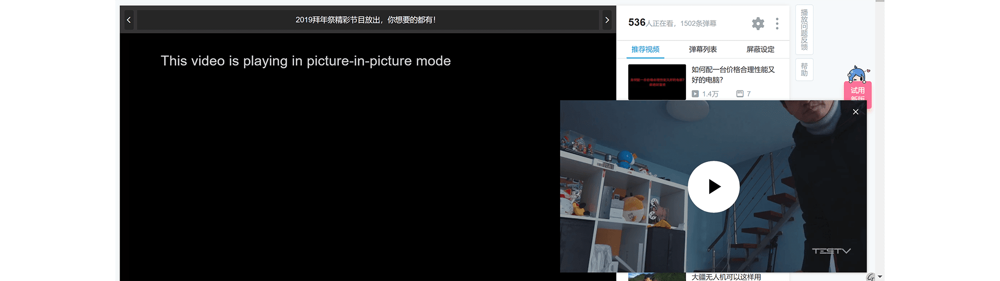

# chromeExtPIP

[TOC]

---

该插件可以让视频是小窗口的形式悬浮在桌面上, 实现办公娱乐两部耽误.

该插件可以在视频变动后自动加载. 并且配合全局快捷键可实现方便地调整进度条.

## 技术说明

该插件基于画中画技术([Picture in Picture](https://w3c.github.io/picture-in-picture/))。

已知支持该技术浏览器：

- chrome 桌面正式版71及以上
- [firefox抢先体验版](https://support.mozilla.org/en-US/kb/about-picture-picture-firefox)

其他浏览器的支持情况未知。

## 安装

### 商店 : 暂无
### 安装包 

- 通过点击找到最新版本, 并保存zip文件到本地.

- 打开Chrome扩展管理页面. 地址栏输入 : [chrome://extensions](chrome://extensions). 并确保开发者模式已开启.

- 将下载的zip文件拖拽到浏览器页面里. 安装完成.

## 设置

### 快捷键设置

**插件在安装或更新后默认没有分配快捷键**, 需要手动分配.

- 快捷键设置页面 : 在浏览器内输入 [chrome://extensions/shortcuts](chrome://extensions/shortcuts) 

- 按照个人喜好分配快捷键. 由于Chrome限制, 用户最多只能分配四个快捷键.

- 如果想全局使用快捷键控制小窗口, **需要选择全局**

快捷键推荐设置：
* 前进：Ctrl + →，Global
* 后退：Ctrl + ←，Global
* 播放暂停：Ctrl + Space，Global
* 音量增：Ctrl + ↑，Global
* 音量减：Ctrl + ↓，Global

### 一般设置
在工具栏右击插件图标, 选择`选项`可打开插件设置界面.

**设置页内各项目：**

* 快进/快退：设置快进、快退的时间间隔，默认5秒。
* 音量增/减：设置音量增、减的大小，默认5%。
* 列表播放不间断：选中后，连续播放的视频都会一直保持在小框口中，默认勾选。
* 快捷键设置：打开快捷键设置页。
* 确定：**点确定，设置才生效**。

## 运行
* 点击插件图标，网页中的视频会进入小窗口（pip）模式，再次点击退出。
* 设置好全局快捷键后，按 Ctrl + ← 可以快退，Ctrl + → 快进，Ctrl + ↑ 音量增，Ctrl + ↓ 音量减。
